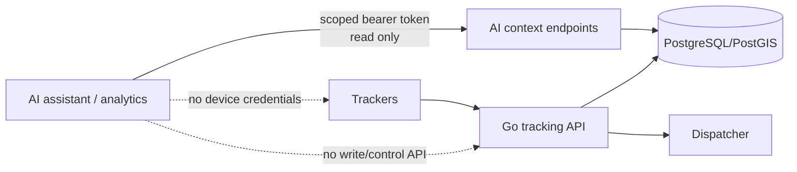
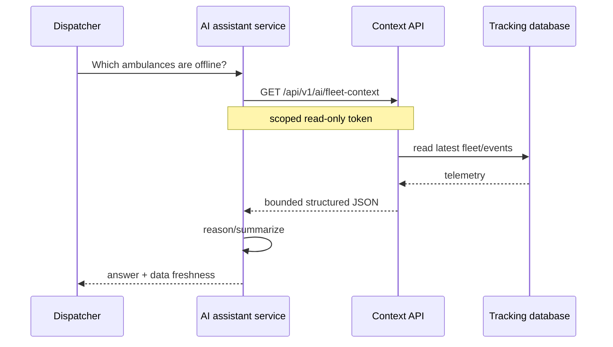
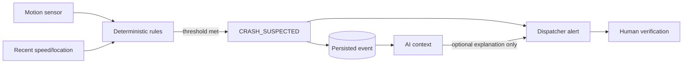

# AI Integration

The tracking service does not embed a language model in the critical telemetry path. Instead, it exposes a small, explicit, read-only operational context API that an authorized AI assistant, automation service, or analytics worker can consume.

This separation is intentional. A tracker fix should still be accepted, persisted, acknowledged, and broadcast if every AI system is offline.

## 1. Boundary



The AI integration has **no endpoint for**:

- sending commands to an ambulance;
- changing a vehicle's location;
- provisioning or revoking devices;
- acknowledging crash alerts;
- changing dispatcher credentials;
- modifying audit logs;
- writing patient/clinical data.

An AI tool can summarize and reason about operational telemetry, but human dispatch remains authoritative.

## 2. Authentication model

An administrator creates a machine token in the dispatcher administration panel. The raw token is shown once. Only its hash is stored in PostgreSQL.

Tokens can be:

- named so their owner/purpose is obvious;
- scoped;
- given an expiry;
- revoked;
- audited through last-use time and normal API request logs.

Current scopes:

| Scope | Intended access |
| --- | --- |
| `fleet:read` | fleet summaries and per-vehicle telemetry/history context |
| `events:read` | reserved for event-specific expansion; current fleet context can include operational alert summaries when the token also has fleet context access |

The token format is opaque to clients. Do not embed it in browser JavaScript, mobile APK resources, source control, prompts, screenshots, or model-training data.

## 3. Endpoints

### Fleet context

```http
GET /api/v1/ai/fleet-context
Authorization: Bearer <scoped token>
```

The response includes:

- generation timestamp;
- normalized fleet freshness counts;
- vehicle IDs/codes/labels/status;
- latest telemetry already available to dispatch;
- unacknowledged operational vehicle events;
- an explicit `patient_data_included: false` field.

### Vehicle context

```http
GET /api/v1/ai/vehicles/{vehicleID}/context?minutes=60
Authorization: Bearer <scoped token>
```

The response includes a bounded window of the newest tracking session plus deterministic summaries such as:

- sample count;
- approximate traveled distance from telemetry samples;
- average and maximum reported speed;
- number of samples recorded while the phone reported no network;
- associated operational events.

The time window is bounded so an AI client cannot accidentally request the entire telemetry database in one call.

## 4. Example operational questions

A local assistant could answer questions such as:

- “Which ambulances have not reported in the last two minutes?”
- “Which units are currently live?”
- “Summarize connectivity problems in the last hour.”
- “Did AMB-02 buffer locations while offline?”
- “What was the highest reported speed for this vehicle in the last 30 minutes?”
- “Are there any unacknowledged crash-candidate alerts?”
- “Summarize the current fleet state for shift handover.”

These answers should always include telemetry time/freshness where relevant. Stale data must not be presented as current merely because an AI can generate fluent prose about it.

## 5. Recommended assistant architecture

For the current environment, a local model service can sit beside the operational stack without being inside the Go API process.



A model should not receive direct SQL credentials. The context API is the policy boundary: it decides which fields, windows, and capabilities are available.

## 6. Tool design for an AI agent

If an agent framework is used, expose narrow tools rather than one broad “call any endpoint” tool.

Recommended tools:

```text
get_fleet_status()
get_vehicle_context(vehicle_id, minutes)
```

Potential future read-only tools:

```text
get_vehicle_eta(vehicle_id, destination)
get_recent_operational_events(hours)
get_fleet_connectivity_summary(window)
```

Keep administrative actions and dispatch decisions outside autonomous AI tools unless a separate risk review explicitly adds approval-gated workflows.

## 7. What AI could add later

### Shift summaries

Generate a factual handover report from structured telemetry:

- units online/offline;
- last-seen times;
- connectivity gaps;
- unusual operational alerts;
- long periods stationary or out of service if vehicle status supports it.

### Telemetry anomaly triage

A conventional statistical detector can flag anomalies; an LLM can explain them in operator-friendly language. Examples:

- repeated reconnect cycles;
- abnormal battery drain;
- long GPS accuracy degradation;
- route discontinuities;
- high offline-queue growth;
- a device that is live but reporting implausibly unchanged telemetry.

The statistical/rule detector should produce the signal. Do not ask an LLM to discover safety-critical anomalies from an unbounded stream of raw coordinates.

### Natural-language fleet lookup

The dispatcher could ask “Where is AMB-03 and when did it last update?” The assistant resolves the vehicle, calls the bounded context endpoint, and answers with the timestamp and freshness.

### Maintenance forecasting

If future vehicle-health data such as battery/charging cycles, tracker temperature, modem quality, or hardware diagnostics is captured, predictive models could estimate tracker maintenance needs. Do not infer mechanical ambulance health from phone GPS telemetry alone.

### Route/coverage analytics

PostGIS plus historical telemetry can generate deterministic coverage features. AI can then summarize those outputs, for example recurring dead zones or common response corridors.

## 8. Crash detection and AI

AI does **not** determine whether a crash happened in the current design.

The Android tracker creates a `CRASH_SUSPECTED` candidate from deterministic sensor thresholds. It includes evidence such as observed g-force, last known speed, location, and a `requires_human_verification` marker.



An AI assistant may summarize the event and surrounding telemetry, but it must not silently upgrade `CRASH_SUSPECTED` into “confirmed crash.”

## 9. Data minimization

The tracker payload currently excludes patient and clinical fields. Keep the AI context API aligned with that boundary.

If another system later joins patient information to a vehicle/time/location, the privacy classification changes. At that point:

- reassess whether the AI provider/process is allowed to receive the data;
- update BAAs/contracts and organizational controls as applicable;
- explicitly whitelist fields rather than passing whole records;
- document retention and prompt/logging behavior;
- consider running the model fully inside the controlled environment.

Source code and an API design alone are not a HIPAA-compliance determination.

## 10. Prompt-injection and model safety

Telemetry strings are mostly machine-generated, but future vehicle labels, operator notes, or incident text could contain arbitrary text. Treat all database content as **data**, not as instructions to the model.

An agent should:

- keep its system/tool policy separate from retrieved telemetry;
- never place API tokens into prompts;
- validate vehicle IDs/time windows server-side;
- allow only predeclared tool calls;
- log tool access without logging bearer tokens;
- refuse model-generated attempts to access admin endpoints with a read token;
- display timestamps/source context with operational answers.

## 11. Availability

AI is a noncritical consumer. If the model server fails:

- tracker collection continues;
- offline queues continue;
- the Go API continues;
- dispatch WebSockets continue;
- route playback continues;
- ETA continues independently;
- only AI-assisted answers are unavailable.

That failure isolation is a design requirement, not an accident.
