# System Architecture

## 1. Purpose and design principles

The ambulance tracking system provides near-real-time fleet location for dispatch while continuing to capture telemetry during temporary loss of cellular/Wi-Fi connectivity.

The design follows a few explicit principles:

- **enqueue before send** — accepted tracker telemetry is durable locally before network transmission;
- **idempotent at-least-once delivery** — retries must be safe;
- **map-first operations** — current fleet position is the primary dispatcher surface;
- **single source of durable truth** — PostgreSQL/PostGIS owns server-side state;
- **human authority for safety events** — phone crash detection can raise a candidate alert but never confirms an emergency by itself;
- **AI outside the critical path** — models may read bounded operational context but cannot control vehicles or mutate dispatch state;
- **incremental infrastructure** — Redis/message buses are added only when horizontal replication creates a real shared-state problem;
- **no patient/clinical fields in tracker telemetry**.

The current production topology is intentionally simple: one Linux VM runs the server-side Docker Compose stack. Android devices are trackers, dispatchers use a browser, and Cloudflare Tunnel provides outbound-only public ingress.

## 2. System context

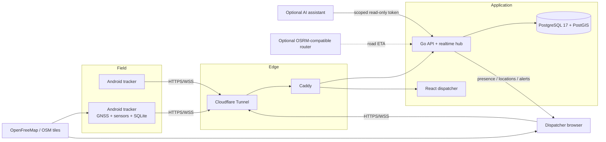

## 3. Runtime components

| Component | Technology | Responsibility |
| --- | --- | --- |
| Android tracker | Kotlin, foreground service, Android location/sensor APIs, SQLite, OkHttp, MapLibre | GNSS acquisition, stabilization, local queue, live send, compressed replay, advisory crash detection, one-code enrollment, local map/status |
| Go service | Go 1.23, `net/http`, `coder/websocket`, pgx | Authentication/MFA, enrollment, telemetry validation, idempotent persistence, dispatcher realtime, history, ETA, events, read-only AI context, audit |
| PostgreSQL/PostGIS | PostgreSQL 17 + PostGIS | Users/devices/sessions, telemetry, spatial points, enrollments, MFA state, API tokens, vehicle events, audit |
| Dispatcher | React 19, strict TypeScript, MapLibre | Map-first fleet operations, realtime status, playback, ETA targets, crash alerts, admin provisioning/security |
| Caddy | Caddy 2 | Same-origin routing, compression/security response headers, private edge |
| Cloudflare Tunnel | cloudflared | Public ingress without origin public IP/host port exposure |
| Optional router | OSRM-compatible HTTP API | Road distance/duration for ETA |
| Optional AI service | local or external model service | Reads deliberately bounded operational context; not in telemetry ingestion path |

## 4. Deployment topology and trust zones

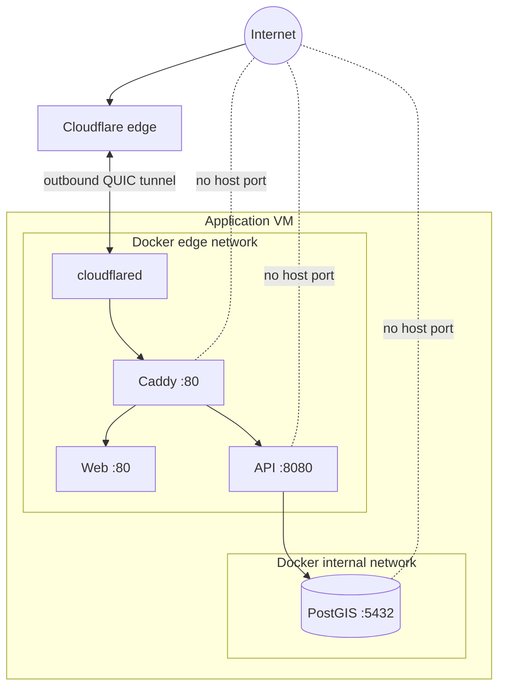

The production Compose topology uses `expose`, not host `ports`. PostgreSQL is attached only to the internal Docker network. Public requests enter through the already-established tunnel and reach Caddy inside the edge network.

## 5. Device provisioning

Routine tracker setup should not require an operator to type a server URL, vehicle code, and long random device key.

### 5.1 One-time enrollment flow

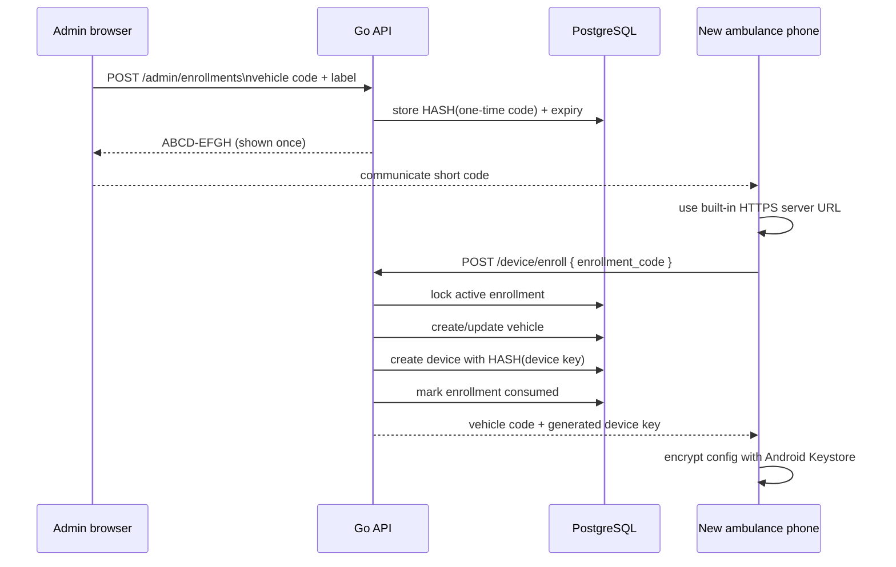

Properties:

- enrollment codes are short-lived and single-use;
- only a hash of the enrollment code is stored;
- the long device key is generated server-side and returned only at successful enrollment;
- only a hash of the long device key is stored server-side;
- Android encrypts the resulting configuration locally;
- manual server URL/device credential entry remains available under **Advanced settings** for recovery/development;
- a vehicle cannot silently acquire a second active tracker through the same workflow;
- revoking a device also revokes its active bearer sessions.

## 6. Tracker telemetry path

### 6.1 Location identity

Every accepted location has an immutable identity:

```text
(device_id, tracking_session_id, sequence_number)
```

The Android service creates a new `tracking_session_id` when the service process starts and increases `sequence_number` within that session. PostgreSQL enforces uniqueness on the full identity.

### 6.2 Live path

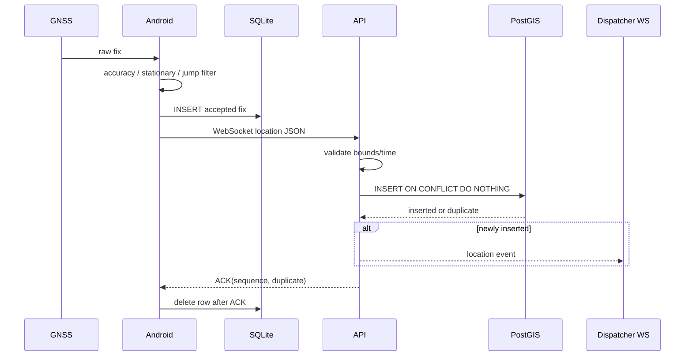

A lost ACK does not cause duplicated server records: the client retries, the unique constraint detects the existing event, and the server returns an ACK with `duplicate=true`.

### 6.3 Offline path and compressed recovery

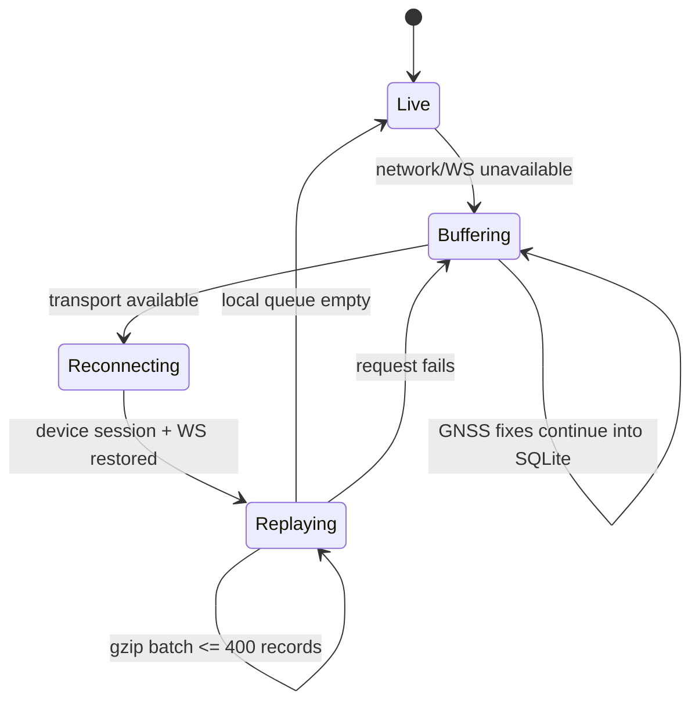

Replay uses HTTP because recovery is a throughput workload rather than a latency workload. The tracker gzip-compresses a JSON envelope and sends up to 400 locations at a time. The API separately bounds compressed and decompressed sizes before decoding.

Live WebSocket frames remain uncompressed: one telemetry record is small, while the CPU/state cost of per-message compression provides much less value than batch compression.

## 7. GNSS stabilization

The client rejects or suppresses telemetry that would reduce route quality:

- accepted-fix cadence is bounded to roughly one second while moving;
- accuracy worse than 50 m is rejected;
- GPS is preferred over network-provider location while GNSS is available;
- a movement implying >70 m/s is rejected unless provider speed supports it;
- low-speed movement inside an accuracy-derived radius is treated as stationary;
- stationary state emits a 15-second heartbeat using the previous stable coordinate.

This is not map matching and is not a Kalman-filter implementation. The server persists the telemetry it receives; the client performs the first quality gate because transmitting known-noisy points wastes network/database capacity.

## 8. Advisory crash detection

The Android tracker listens to `TYPE_LINEAR_ACCELERATION` when available and falls back to the accelerometer with an estimated gravity component removed.

A crash candidate currently requires:

- significant acceleration impulse (default 3.0g threshold);
- recent vehicle speed of at least 8 m/s (~29 km/h);
- no candidate in the previous 60 seconds.

A stronger impulse (default 4.5g) is marked `critical`; otherwise the candidate is `warning`.

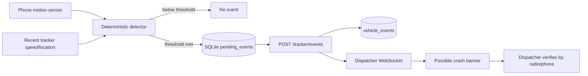

The event includes `requires_human_verification=true`. It is deliberately called `CRASH_SUSPECTED`, not `CRASH_CONFIRMED`.

Crash events use enqueue-before-send too. A candidate detected with no Internet remains in local SQLite and is retried later.

Phone-only crash detection is advisory. Device mounting, handset motion, potholes, drops, sensor calibration, and Android background behavior can all affect the signal. It must be field-calibrated against representative ambulance hardware before operational reliance.

## 9. Dispatcher architecture

The dispatcher combines persisted hydration with realtime deltas:

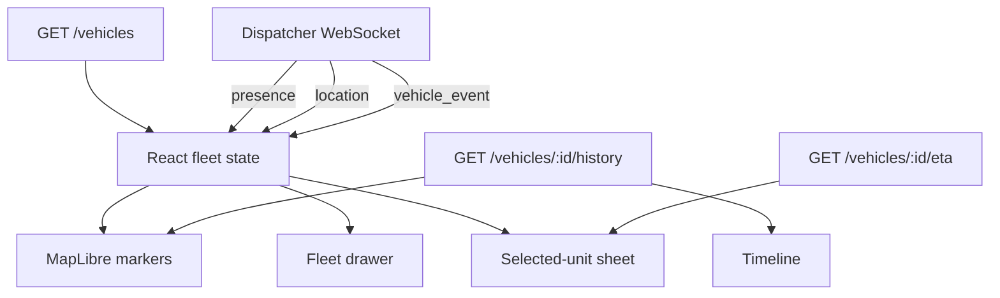

The map is a full-screen canvas. Search, fleet list, realtime status, selected-unit detail, playback and administration float over it instead of forming permanent dashboard columns.

Live markers visually interpolate between one-second telemetry points. This improves perceived smoothness without increasing GNSS/network frequency.

Freshness states:

- `LIVE`: tracker connected or newest data <5 s;
- `DELAYED`: 5–30 s;
- `STALE`: 30–120 s;
- `OFFLINE`: >120 s;
- `NO DATA`: no telemetry.

## 10. Historical playback and session isolation

Historical playback never concatenates arbitrary records just because they belong to the same vehicle.

The SQL query:

1. finds the newest `tracking_session_id` inside the requested time window;
2. filters history to that session only;
3. orders chronologically;
4. deterministically down-samples large traces;
5. preserves first and last points;
6. returns at most the configured maximum.

This prevents an old simulator/test session from being drawn as a line to a new real physical-phone session.

## 11. ETA architecture

The UI enters “ETA target” mode and the dispatcher clicks a destination on the map.

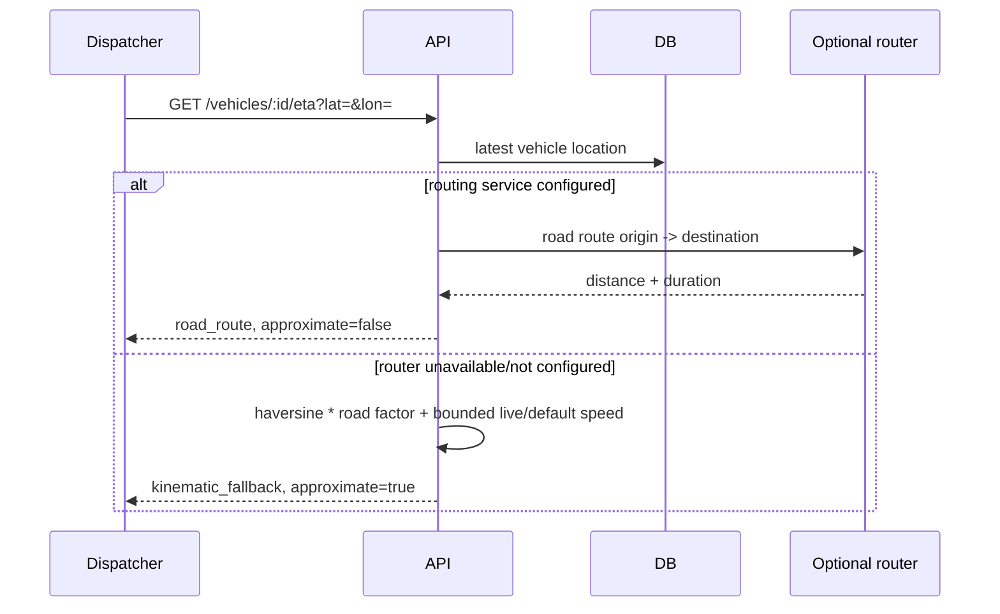

ETA responses are cached briefly in memory to avoid repeatedly asking a route engine for effectively the same moving origin/destination pair.

The fallback is intentionally labeled approximate. It is not represented as road navigation.

## 12. Dispatcher authentication and TOTP MFA

### 12.1 Password session without MFA

Users have bcrypt password hashes. Successful authentication creates an opaque random browser session and CSRF token; only their hashes are stored.

### 12.2 MFA-enabled login

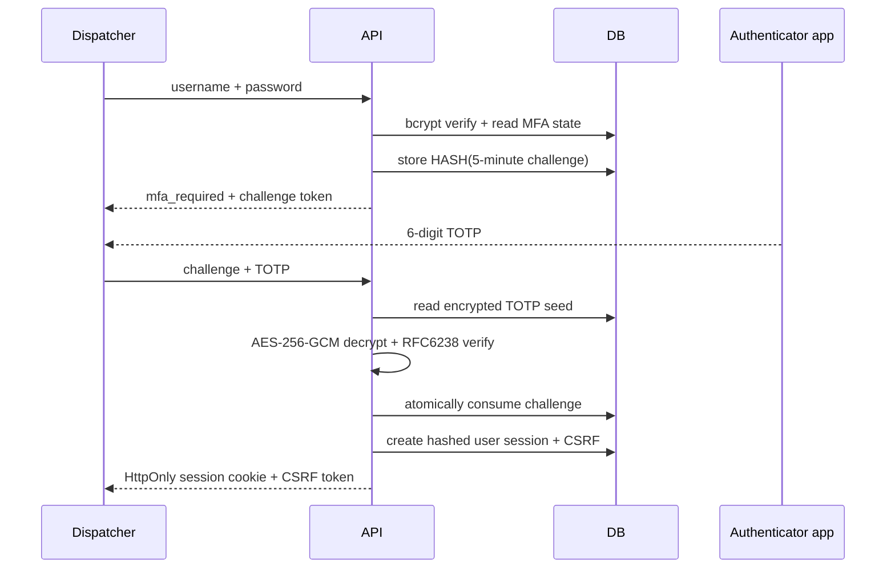

TOTP seeds are encrypted at rest using a 32-byte deployment key supplied through `MFA_ENCRYPTION_KEY`. The encryption key is not stored in PostgreSQL.

The system accepts one TOTP step before/after current time to tolerate modest clock drift. The MFA challenge itself is single-use and expires after five minutes.

## 13. Administrative authorization

Two user roles exist:

- `dispatcher` — fleet view/history/events/ETA;
- `admin` — dispatcher capabilities plus provisioning/device/API-token administration.

Administrative routes perform an explicit role check in addition to requiring a valid browser session and CSRF protection for writes.

## 14. AI boundary

AI is a read-only consumer, not a member of the tracking control plane.

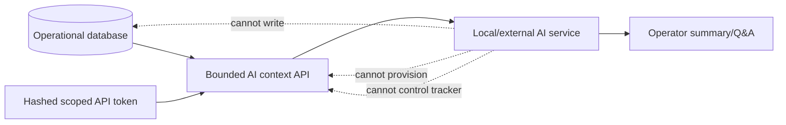

Current context APIs expose fleet freshness, latest telemetry, bounded per-vehicle history summaries and operational events. They explicitly state that patient data is not included in the current payload model.

The model provider is deliberately decoupled. A local model can use the same API as an external service without changing the tracking server.

See [AI_INTEGRATION.md](AI_INTEGRATION.md).

## 15. Persistence model

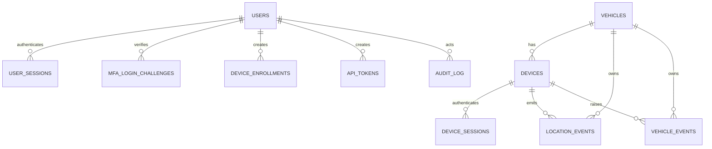

Key tables:

| Table | Purpose |
| --- | --- |
| `vehicles` | Fleet identity/status |
| `devices` | Tracker identity, long device-key hash, active/revoked state |
| `device_sessions` | Short-lived hashed bearer sessions |
| `device_enrollments` | Hashed one-time enrollment codes + expiry/consumption state |
| `users` | Dispatcher/admin identity + bcrypt password + encrypted TOTP state |
| `mfa_login_challenges` | Hashed, short-lived, single-use second-factor challenges |
| `user_sessions` | Hashed browser session + CSRF state |
| `api_tokens` | Hashed scoped machine tokens |
| `location_events` | Immutable GPS telemetry + generated geography point |
| `vehicle_events` | Advisory safety/operational events + acknowledgement state |
| `audit_log` | Security/operational audit events |

## 16. Security boundaries

Controls implemented in code/topology include:

- HTTPS-required normal Android configuration;
- no public PostgreSQL/API/Caddy host ports in production Compose;
- device keys/session tokens/API tokens stored as hashes server-side;
- TOTP secret encrypted at rest with AES-256-GCM;
- bcrypt user passwords;
- HttpOnly/Secure/SameSite browser cookie in production;
- CSRF validation on authenticated browser writes;
- role enforcement for admin routes;
- authentication/enrollment/MFA attempt rate limiting;
- bounded request bodies/WebSocket reads;
- gzip decompression limits;
- restrictive CSP/XFO/COOP/CORP/referrer/permissions headers;
- API `Cache-Control: no-store`;
- short-lived browser/device sessions;
- periodic WebSocket session revalidation;
- audit events around authentication, enrollment, telemetry replay, history, event acknowledgement and token management.

These controls support a secure deployment. They are not a claim that source code itself is HIPAA compliant/certified. See [SECURITY.md](SECURITY.md) and [HIPAA.md](HIPAA.md).

## 17. Failure behavior

| Failure | Expected behavior |
| --- | --- |
| Tracker loses Internet | GNSS + sensor collection continues; locations/events queue locally |
| Tracker WS closes | reconnect with exponential delay capped at 10 s |
| ACK lost | location is resent; DB uniqueness makes retry safe |
| API unavailable | tracker buffers; dispatcher cannot receive live state |
| PostgreSQL unavailable | health becomes unhealthy; telemetry cannot be committed/ACKed |
| Cloudflare/Tunnel unavailable | public path fails; tracker continues buffering |
| Map tile service unavailable | telemetry transport/storage continues; visualization degrades |
| Router unavailable | dispatcher gets explicitly approximate ETA fallback |
| AI service unavailable | no effect on tracking/dispatch/replay/ETA; AI answers unavailable only |
| Tracker restarts | new tracking session; history isolation prevents false route joins |
| Device revoked | bearer sessions are revoked; tracker must be re-provisioned/admin-restored |
| MFA key missing for MFA-enabled user | login fails closed at second factor rather than bypassing MFA |

## 18. Why Redis is not currently deployed

The current API is one Go process. Its process-local state consists primarily of:

- dispatcher WebSocket connections;
- rate-limit counters;
- short ETA cache.

Adding Redis now would not make durable telemetry safer because PostgreSQL already owns durable state. It would add another service to patch, secure, monitor and back up.

Redis/NATS/shared messaging becomes important when there are multiple API replicas:

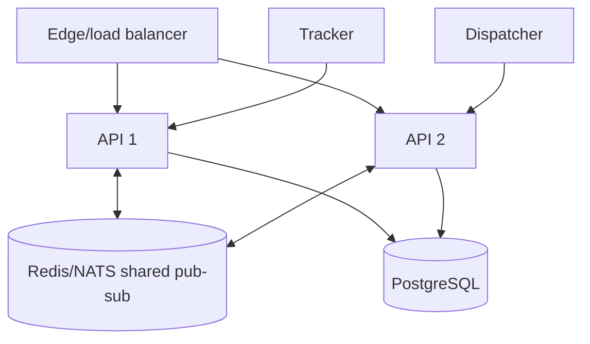

Without shared pub/sub, a tracker connected to API 1 cannot notify a dispatcher WebSocket living in API 2's memory. At horizontal scale, shared pub/sub plus distributed rate-limit/presence semantics should be introduced before simply increasing replica count.

See [PERFORMANCE.md](PERFORMANCE.md) for the scale roadmap.

## 19. Architectural limits still open

The current architecture is strong for a small fleet and one-site deployment, but production acceptance still has explicit work:

- single active API/realtime process;
- one PostgreSQL instance without application-managed HA;
- no built-in immutable/off-host audit-log pipeline;
- no MDM integration yet;
- physical two-phone, screen-locked, battery-saver and long-soak testing still required;
- crash thresholds need real mounted-device calibration;
- road ETA requires an operational routing source if approximate fallback is insufficient;
- production mapping should not rely indefinitely on a free public tile service;
- Gradle wrapper is still not committed; CI provisions Gradle 8.9.

The repository treats these as visible engineering constraints, not hidden assumptions.
