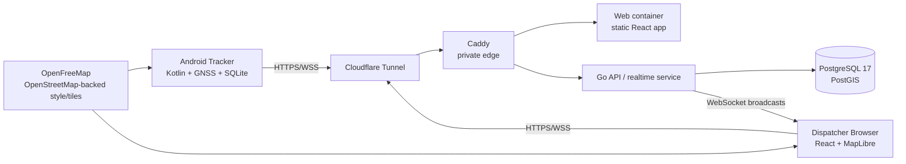
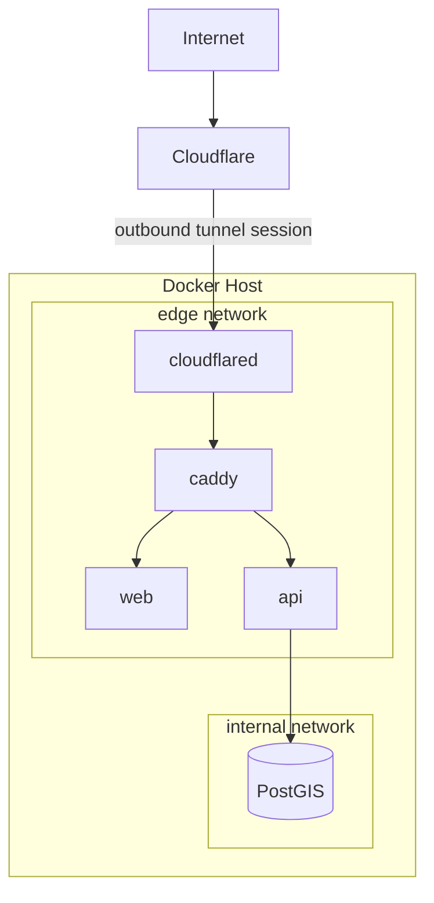
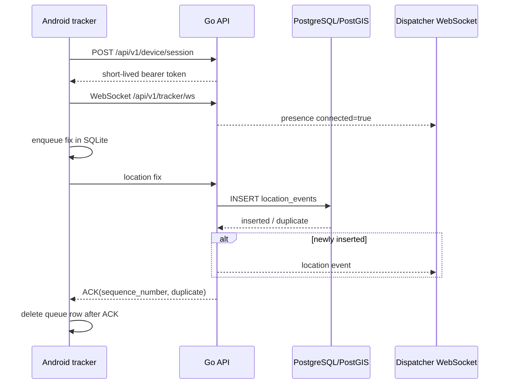

# System Architecture

## 1. Purpose

The ambulance tracking system provides near-real-time vehicle telemetry for a dispatcher while preserving location records during temporary loss of Internet connectivity.

The current deployment model is intentionally simple: one Linux host or VM runs the server-side stack with Docker Compose. Android devices act as trackers. Dispatchers use a web browser. Public ingress is provided through Cloudflare Tunnel, so the origin does not require a public IP address or exposed inbound HTTP/HTTPS ports.

The system does **not** carry patient or clinical fields in tracker payloads.

## 2. System context



## 3. Major components

| Component | Technology | Responsibility |
| --- | --- | --- |
| Android tracker | Native Kotlin, Android foreground location service, SQLite, OkHttp, MapLibre | Acquire GNSS fixes, stabilize obvious GPS noise, enqueue before transmission, send live telemetry, replay buffered telemetry, show local status/map |
| API/realtime service | Go 1.23, `net/http`, `coder/websocket` | Authentication, session validation, telemetry validation/persistence, ACK/NACK handling, dispatcher fleet/history APIs, realtime broadcasts, audit events |
| Data store | PostgreSQL 17 + PostGIS | Users, devices, sessions, vehicle metadata, telemetry, geospatial point data, audit records |
| Dispatcher | React 19, strict TypeScript, Vite, MapLibre GL | Authenticate dispatcher, show fleet state, receive live presence/location events, display telemetry, route playback |
| Caddy | Caddy 2 | Same-origin routing from the private edge to API and web services, response/security headers |
| Tunnel | Cloudflare Tunnel | Outbound-only public ingress to `http://caddy:80` |
| Mapping | OpenFreeMap / OpenStreetMap-backed data | Basemap for Android and dispatcher views |

## 4. Deployment topology

The supplied production topology uses two Docker networks:

- `internal` — isolated network containing PostgreSQL and the API. PostgreSQL is not connected to the public edge network.
- `edge` — Caddy, web, API, and Cloudflare Tunnel connectivity.

The application services use `expose`, not host `ports`, in the production Compose stack. The Cloudflare connector reaches Caddy over the Docker `edge` network. The local-development overlay publishes Caddy on localhost for development only.



## 5. Tracker data flow

### 5.1 Startup and authentication

1. The tracker loads its encrypted local configuration: server URL, vehicle code, and device key.
2. The app requires an HTTPS server URL and precise location permission.
3. The foreground service starts and requests GNSS updates.
4. The tracker exchanges its long-lived device key at `POST /api/v1/device/session` for a short-lived bearer token.
5. It opens `GET /api/v1/tracker/ws` as a WebSocket using that bearer token.

### 5.2 Enqueue-before-send

Every accepted location fix is written to the app-private SQLite queue **before** it is sent to the server.

Each event is identified by:

```text
(tracking_session_id, sequence_number)
```

The server enforces the same identity through a unique database constraint on `(device_id, tracking_session_id, sequence_number)`.

This creates idempotent at-least-once delivery behavior:

- if the first transmission succeeds, the server ACKs it and the tracker removes the matching local queue row;
- if an ACK is lost, retransmission is safe because the server recognizes the duplicate;
- if connectivity is unavailable, the queue remains local until the server is reachable again.

### 5.3 Live WebSocket path



### 5.4 Offline replay

When the WebSocket reconnects, the tracker posts queued rows to `POST /api/v1/tracker/history` in batches of up to 200 records from the local queue. The server accepts request batches of up to 500 locations. Successfully handled rows are deleted from the local SQLite queue.

The local pending-location database trims rows older than seven days when the service starts. Server-side `location_events` currently have no automatic retention policy in the application schema; production retention must therefore be defined operationally.

## 6. GNSS stabilization

The Android service contains lightweight protection against obvious route corruption from stationary wander or impossible jumps:

- accepted fix interval is bounded to approximately one second;
- fixes reporting accuracy worse than 50 m are rejected;
- GPS is preferred over network location when GNSS is enabled;
- movement implying more than 70 m/s is rejected unless the provider-reported speed supports the movement;
- low-speed movement inside an accuracy-derived stationary radius is treated as stationary;
- stationary state emits a low-rate heartbeat using the previous stable coordinate rather than drawing GNSS noise as a route.

This is a pragmatic telemetry filter, not a full map-matching or Kalman-filter implementation.

## 7. Dispatcher data flow

The dispatcher uses two complementary paths:

1. `GET /api/v1/vehicles` hydrates the current fleet state from persisted data.
2. `/api/v1/dispatch/ws` provides live `presence` and `location` events.

The UI computes freshness states from connection state and latest telemetry time:

- `LIVE` — tracker connected, or latest data younger than 5 seconds;
- `DELAYED` — 5–30 seconds;
- `STALE` — 30–120 seconds;
- `OFFLINE` — older than 120 seconds;
- `NO DATA` — no telemetry has been received.

Historical route playback requests a bounded window from the API. The server returns only the most recent `tracking_session_id` in that requested window so a simulator, device restart, or previous app run cannot be joined into a false route. Large result sets are deterministically down-sampled in PostgreSQL to at most 5,000 points.

## 8. Persistence model

### 8.1 Core tables

| Table | Purpose |
| --- | --- |
| `vehicles` | Provisioned fleet units and operational status |
| `devices` | Tracker identity bound to a vehicle; stores only the device-key hash |
| `device_sessions` | Short-lived hashed bearer sessions for trackers |
| `users` | Dispatcher/admin identities with bcrypt password hashes |
| `user_sessions` | Dispatcher session-token and CSRF hashes |
| `location_events` | Immutable telemetry with vehicle/device/session/sequence identity and generated PostGIS geography point |
| `audit_log` | Authentication, connection, fleet/history-read, replay and related audit events |

### 8.2 Telemetry record

A `location_events` row contains:

- vehicle and device IDs;
- tracking session UUID and sequence number;
- device-recorded timestamp and server-received timestamp;
- latitude/longitude;
- optional accuracy, speed, bearing, altitude, and battery percentage;
- network type;
- generated PostGIS `geography(Point, 4326)` value.

No patient identifier, destination, diagnosis, treatment, or clinical payload exists in the tracker record model.

## 9. Authentication and authorization

### Dispatcher

- Username/password authentication.
- Passwords stored with bcrypt.
- Opaque random session token stored in an `HttpOnly` cookie.
- Session token and CSRF token are hashed before database storage.
- Cookie uses `SameSite=Strict`; production enables `Secure` cookies.
- Dispatcher WebSocket periodically revalidates its session and closes when the session expires or is revoked.
- Current application roles are `dispatcher` and `admin`, although the existing API surface does not yet expose a broad role-specific permission matrix.

### Tracker

- Long-lived per-device secret is exchanged for a short-lived bearer session.
- Device secrets and bearer tokens are stored only as hashes server-side.
- Android stores its long-lived configuration using Android Keystore-backed encryption.
- Tracker WebSocket periodically revalidates the bearer session.

### Rate limiting

Authentication endpoints use application-level fixed-window rate limiting. The implementation is process-local; if the API is horizontally replicated, rate limiting would also need to move to shared state or the edge.

## 10. Realtime architecture constraint

The dispatcher WebSocket hub is currently in-memory inside one Go process. This is correct for the current single-node deployment, but it is the main constraint on horizontal API scaling.

If multiple API replicas are introduced, realtime broadcasts and connection-presence state must be backed by shared infrastructure such as PostgreSQL `LISTEN/NOTIFY`, Redis, NATS, or another message bus. Simply adding more Go containers behind a load balancer would otherwise split trackers and dispatchers across isolated in-memory hubs.

## 11. Failure behavior

| Failure | Expected behavior |
| --- | --- |
| Cellular/Wi-Fi loss on tracker | GNSS continues; accepted fixes remain queued locally; UI reports buffering |
| WebSocket disconnect | Tracker reconnects with exponential delay capped at 10 seconds |
| Lost ACK | Duplicate replay is safe because persistence is idempotent |
| API unavailable | Tracker continues queueing locally; dispatcher loses live updates |
| PostgreSQL unavailable | `/healthz` becomes unhealthy; new telemetry cannot persist |
| Cloudflare/Tunnel unavailable | Public clients cannot reach origin; tracker buffers locally |
| Map tile provider unavailable | Tracking transport/persistence can continue, but map visualization degrades |
| Tracker restart | New tracking session UUID is created; playback isolation prevents joining sessions |

## 12. Security boundaries

The architecture intentionally keeps PostgreSQL private, requires HTTPS in the Android UI, uses short-lived application sessions, hashes server-side secrets, and records auditable actions. Caddy and the application add restrictive browser/security headers.

These controls support a secure deployment but are not, by themselves, a claim of HIPAA compliance. See [SECURITY.md](SECURITY.md) and [HIPAA.md](HIPAA.md) for the remaining organizational and deployment controls.

## 13. Current architectural limits

The current design is appropriate for a small single-site fleet prototype and initial deployment, but the following are explicit limits:

- single Go realtime hub / single API process assumption;
- one PostgreSQL instance with no application-level HA orchestration;
- no built-in server-side telemetry-retention job;
- no production MFA/SSO yet;
- no centralized immutable log shipping included in the repository;
- no MDM integration for managed Android devices;
- production mapping should not depend indefinitely on a free public tile service;
- the Android project currently depends on CI-provisioned Gradle rather than a committed Gradle wrapper.

These items are tracked as production hardening or future-scale work rather than hidden behind the prototype label.
