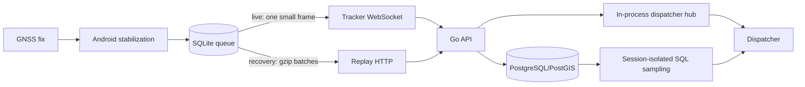
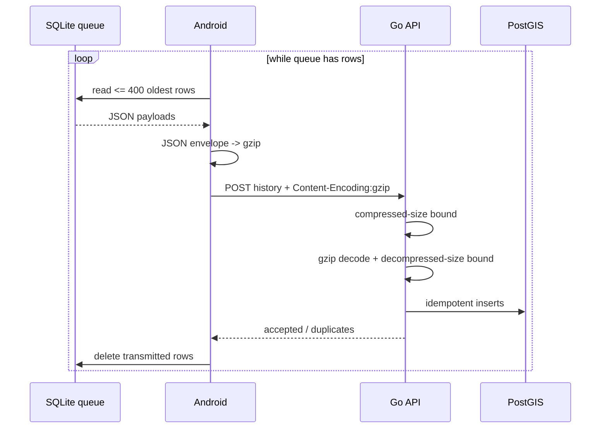
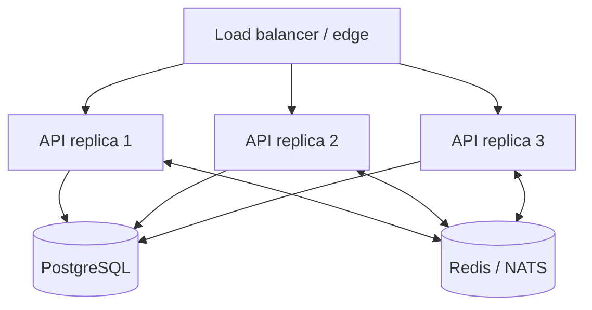
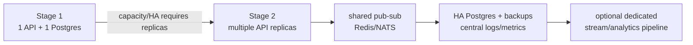

# Performance and Scaling

This document describes the current performance model, the changes made to reduce tracker bandwidth and server work, and the point at which additional infrastructure such as Redis becomes justified.

## 1. Performance goals

For this system, performance is not about maximizing synthetic requests per second. The important objectives are:

1. fresh dispatcher positions while connectivity exists;
2. no lost accepted telemetry when connectivity disappears;
3. low cellular overhead per ambulance;
4. bounded recovery traffic when an ambulance comes back online;
5. predictable database queries as location history grows;
6. a dispatcher UI that remains responsive with multiple live units and long route histories;
7. no new infrastructure unless it removes a demonstrated bottleneck or reliability constraint.

## 2. Hot paths



The architecture intentionally uses different transports for different workloads:

- **live movement:** WebSocket, one accepted fix at a time, optimized for latency;
- **offline recovery:** HTTP batches, optimized for throughput and compression;
- **historical playback:** server-side bounded queries, optimized to keep large raw datasets away from the browser.

## 3. Tracker call efficiency

### 3.1 Live telemetry

A moving tracker generally emits approximately one accepted fix per second. Each live fix is a small JSON WebSocket message.

WebSocket per-message compression remains disabled deliberately. For small one-record messages, compression introduces compressor state, CPU work, and implementation complexity while saving relatively little compared with compressing a large repetitive batch. The persistent WebSocket already removes repeated HTTP request/response setup from the live path.

The tracker also avoids sending every raw GNSS callback:

- fixes closer together than the minimum interval are ignored;
- low-quality fixes are rejected;
- stationary GNSS wander is suppressed;
- stationary state uses a low-rate heartbeat;
- impossible one-off jumps are rejected.

This saves bandwidth by avoiding data that would not improve operational accuracy.

### 3.2 Offline replay

Offline replay is where JSON repetition becomes expensive. A replay body contains the same property names hundreds of times:

```json
{
  "tracking_session_id": "...",
  "sequence_number": 123,
  "recorded_at": "...",
  "latitude": 17.31,
  "longitude": -62.74,
  "accuracy_m": 7.2,
  "speed_mps": 12.4,
  "battery_pct": 81,
  "network_type": "NONE"
}
```

Repeated JSON keys compress extremely well with gzip. The Android tracker therefore now:

1. reads up to 400 queued locations;
2. constructs one JSON replay envelope;
3. gzip-compresses the complete envelope;
4. sends `Content-Encoding: gzip`;
5. deletes local queue rows only after a successful server response;
6. iteratively repeats until the queue is empty or a request fails.

The server independently bounds both the compressed request and the decompressed JSON stream. This is important: accepting gzip without a decompressed-size limit would create a decompression-bomb risk.



### Why not Protobuf yet?

A binary protocol such as Protobuf could reduce payload size further, but it would add generated schemas and versioning complexity across Kotlin, Go, tests, and debugging tooling. Gzipped JSON captures much of the available win for large replay batches while keeping the protocol observable and easy to evolve.

A binary protocol becomes worth measuring if cellular transfer volume, CPU use, or fleet scale shows gzip JSON to be a real bottleneck. It should be chosen from measurements, not because binary serialization is theoretically smaller.

## 4. HTTP and WebSocket connection behavior

The Android client uses one shared OkHttp client with connection pooling. It does not establish a new TCP/TLS connection for every live fix; the normal live path is a persistent WebSocket.

Authentication uses a long-lived device secret only to obtain a short-lived bearer session. The session is then reused for the tracker WebSocket and recovery requests until it expires/reconnects.

Reconnect backoff grows from one second to a maximum of ten seconds. This prevents a disconnected fleet from tight-looping against an unavailable server.

## 5. Database efficiency

The database model is append-heavy. `location_events` are immutable after insertion.

Important indexes include:

- `(vehicle_id, recorded_at DESC)` for current/history reads;
- `(device_id, tracking_session_id, sequence_number)` for replay identity/lookups;
- GiST on the generated PostGIS geography point for future spatial queries;
- partial indexes on active user/device/API sessions.

Idempotency is enforced by a database uniqueness constraint rather than only in application memory. That keeps duplicate replay correct across process restarts.

### Historical playback

The browser does not receive an unbounded raw 1 Hz trace. PostgreSQL:

1. identifies the newest tracking session in the requested window;
2. filters to that session;
3. counts/order-numbers the rows;
4. deterministically samples large histories;
5. always preserves the first and last points;
6. returns at most the server-defined playback point limit.

This prevents a 24-hour route from automatically turning into tens of thousands of DOM/MapLibre updates.

## 6. Dispatcher rendering efficiency

The map is the primary surface; operational panels float over it rather than forcing a permanent three-column layout.

Live marker movement is visually interpolated over a short animation window. This makes one-second GPS updates appear smooth without increasing tracker sample frequency or network traffic.

Route history is rendered as GeoJSON sources/layers instead of hundreds or thousands of independent marker DOM nodes. Only live vehicle markers use DOM-backed MapLibre markers.

`prefers-reduced-motion` disables nonessential UI animations for accessibility and lower-motion environments.

## 7. ETA efficiency

Road ETA requests can be comparatively expensive because they may invoke a routing engine. The API therefore maintains a short-lived in-process ETA cache keyed by vehicle/origin/destination.

Destination coordinates are rounded for cache reuse at roughly street-scale precision. The cache is intentionally short because the origin is moving.

If no routing engine is configured, the API uses a clearly marked approximate kinematic fallback rather than failing the entire UI or pretending straight-line geometry is a real road route.

## 8. Do we need Redis?

**Not for the current single-API-node deployment.**

Adding Redis today would create another network service, persistence/backup decision, credential, monitoring target, and failure mode while duplicating state that one Go process can maintain cheaply in memory.

Current process-local state:

- dispatcher WebSocket connection registry;
- fixed-window login/enrollment rate-limit counters;
- short-lived ETA cache.

All authoritative durable state is already in PostgreSQL.

### Redis becomes useful when the API scales horizontally



Without a shared event bus, a tracker connected to API replica 1 cannot directly notify a dispatcher WebSocket connected to API replica 2 because each process owns a separate in-memory hub.

At that point shared infrastructure should handle at least:

- cross-replica telemetry/event pub-sub;
- shared presence semantics if exact connected-state matters;
- distributed rate limits;
- optionally short-lived ETA/cache entries.

Redis is one reasonable choice. NATS is also attractive if the requirement is primarily realtime pub-sub rather than a general key/value cache. PostgreSQL `LISTEN/NOTIFY` could support modest cross-process broadcasts with fewer dependencies, but it couples realtime fan-out more tightly to the primary database.

### Scale trigger

Do not add Redis because the application has “realtime” in its description. Add shared messaging when one of these becomes true:

- more than one API replica is deployed;
- a failover design requires a second active API process;
- process-local rate limiting is no longer acceptable;
- measured routing/cache load benefits from shared caching;
- independent consumers need a telemetry/event stream.

## 9. Scaling roadmap



For a small national ambulance fleet, Stage 1 can support far more tracker messages than the fleet is likely to generate. Reliability work such as backups, monitoring, device management, power/network redundancy, and operational drills is likely to create more value before horizontal application scaling.

## 10. Measurements to capture in production testing

Record these during long-duration and multi-device acceptance tests:

- accepted fixes per minute per tracker;
- median and p95 live end-to-end age at dispatcher;
- bytes transmitted per tracker per hour on cellular;
- offline queue growth rate;
- replay drain rate after connectivity restoration;
- average compressed replay size and compression ratio;
- API request latency;
- database insert latency;
- history query time and returned point count;
- API CPU/RSS;
- PostgreSQL CPU, cache hit ratio, database size and index size;
- Android battery drain per hour;
- routing request latency/cache hit rate if road ETA is enabled.

Optimization should follow those measurements.
