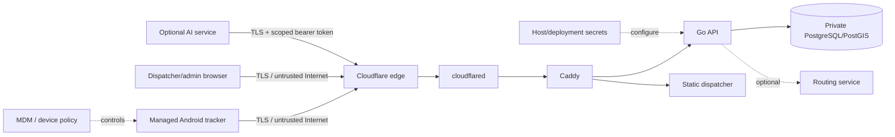
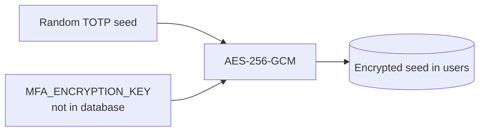
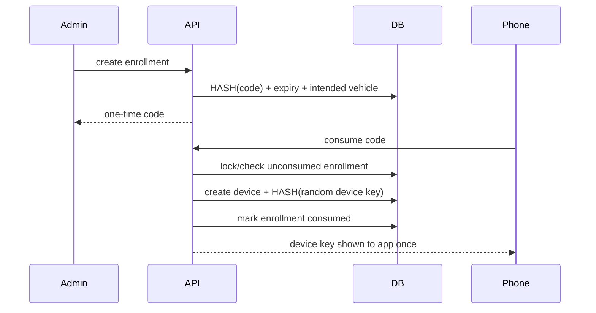

# Security Model

## 1. Scope

This document describes application and deployment security controls implemented in the repository. It is not a compliance certification and does not replace an organizational risk assessment, penetration test, MDM policy, incident-response process, or HIPAA analysis. See [HIPAA.md](HIPAA.md) for the regulatory deployment boundary.

## 2. Security objectives

The system is designed so that:

- only provisioned tracker identities can submit telemetry;
- routine device provisioning does not require manually handling long device secrets;
- only authenticated dispatcher/admin users can read fleet data;
- administrative actions require an explicit `admin` role;
- password compromise can be mitigated with TOTP MFA;
- long-lived server-side credentials/tokens are hashed where verification does not require recovery;
- TOTP seeds are encrypted because they must be recoverable for verification;
- AI/machine integrations are read-only, scoped and revocable;
- network exposure is minimized;
- telemetry/event retries are idempotent;
- untrusted inputs and decompression are bounded;
- crash-candidate alerts are not represented as confirmed emergencies;
- tracker payloads exclude patient/clinical fields by design.

## 3. Trust boundaries



Important boundaries:

1. **Android device** — a stolen/unmanaged phone may expose operational data and, if the OS/device is compromised, app credentials despite Keystore usage.
2. **Public network** — production client traffic must use HTTPS/WSS.
3. **Edge/origin** — Cloudflare/Caddy are in the request path; their configuration is part of the threat model.
4. **Application** — the Go API is the only component allowed to translate authenticated requests into database access.
5. **Database** — PostgreSQL is not exposed on a production host port.
6. **Operations** — VM root access, `.env`, tunnel credentials, database passwords, signing keys, MFA encryption key, backups and MDM are outside the app's own protection boundary.
7. **AI integration** — a model gets a narrow read API, not SQL credentials or admin credentials.

## 4. Dispatcher identity and TOTP MFA

### Passwords

User passwords are hashed with bcrypt. Passwords are not stored reversibly.

A successful single-factor login issues:

- an opaque random user-session token;
- a separate opaque CSRF token;
- an `HttpOnly` session cookie.

Only hashes of the session and CSRF values are stored in PostgreSQL. Production cookies are `Secure` and `SameSite=Strict`.

### MFA setup

A signed-in user can start TOTP setup. The API generates a random TOTP seed and returns it once in an `otpauth://` URI/manual secret so it can be added to an authenticator app.

The TOTP seed is then stored **encrypted**, not hashed, because verification requires the original secret. Encryption uses AES-256-GCM with a 32-byte deployment key supplied in `MFA_ENCRYPTION_KEY`.



The encryption key must be backed up securely. Losing it makes existing MFA seeds unverifiable; exposing it plus the database weakens the second factor.

### MFA login

For an MFA-enabled user, password verification does **not** issue an authenticated browser session. Instead:

1. the server creates a random five-minute MFA challenge;
2. only the challenge hash is stored;
3. the browser submits that challenge plus a six-digit TOTP;
4. the server verifies the TOTP with a ±1 time-step tolerance;
5. the challenge is consumed once;
6. only then is the normal browser session created.

If an MFA-enabled account exists but the deployment encryption key is unavailable, login fails closed rather than silently bypassing MFA.

### Remaining authentication gap

TOTP meaningfully improves local-account security but does not provide centralized identity lifecycle, conditional access, hardware-backed phishing-resistant factors, or organization-wide offboarding. A future production identity-provider/SSO path may still be preferable for larger deployments.

## 5. Tracker identity and enrollment

### Long-lived device credentials

Each active tracker has a random device key. The server stores only `SHA-256(device_key)`. Device authentication exchanges that key for a short-lived bearer session; bearer tokens are also stored only as hashes.

Android stores its server URL/vehicle code/device key in a Keystore-backed encrypted configuration.

### One-time enrollment

Routine provisioning uses a short-lived enrollment code instead of manually distributing the long device key.



Security properties:

- code is source-IP rate limited;
- code is hashed at rest;
- code expires;
- code is single-use;
- consumption is transactional;
- an existing active tracker blocks silent duplicate enrollment for the same vehicle;
- the generated device key is returned only on successful enrollment;
- server URL/manual credentials are hidden under Android **Advanced settings**, reducing routine secret handling.

The human-friendly code has less entropy than a device key, which is why its short validity, one-time semantics and rate limiting matter.

## 6. Device revocation

Admin device revocation:

1. marks the device inactive;
2. revokes currently active device sessions in the same operation path;
3. causes periodic WebSocket session revalidation/reconnect authentication to fail.

Device-key rotation tooling similarly revokes existing device sessions.

## 7. Machine / AI tokens

Machine integrations use opaque API tokens prefixed for recognizability. The raw value is shown only on creation; PostgreSQL stores only its hash.

Tokens have:

- human-readable name;
- scope list;
- optional expiry;
- creation metadata;
- last-used timestamp;
- revocation state.

Current exposed AI endpoints are read-only. A fleet/AI token cannot call browser-admin handlers because those require an authenticated user cookie, CSRF token and admin role.

Never put raw machine tokens in prompts, browser local storage, source control, screenshots or model-training corpora.

## 8. Authorization model

Application users have roles:

- `dispatcher` — operational fleet reads, history, ETA, events, dispatcher WebSocket;
- `admin` — dispatcher access plus device enrollment/revocation and API-token administration.

Administrative handlers explicitly check `role == admin` after validating the database-backed browser session.

Browser writes also require the session-specific CSRF token.

## 9. Session lifecycle

### Dispatcher

- session is database-backed;
- logout revokes the current session;
- password rotation revokes existing sessions;
- dispatcher WebSockets periodically revalidate the database session;
- expired/revoked sessions close the WebSocket.

### Tracker

- tracker WebSocket requires a valid bearer token before upgrade;
- device session is revalidated periodically;
- device revocation/key rotation invalidates sessions;
- bearer lifetime is intentionally shorter than the device key lifetime.

### MFA challenges

- five-minute lifetime;
- random opaque token;
- hash stored in database;
- consumed after successful verification;
- separate source-IP attempt limiter.

## 10. Authentication and enrollment rate limits

Current fixed-window process-local limits include:

- dispatcher password login: 10 attempts/source IP/minute;
- device session creation: 20 attempts/source IP/minute;
- device enrollment: 12 attempts/source IP/minute;
- MFA verification: 12 attempts/source IP/minute.

These are appropriate to the current single-process deployment. If API replicas are added, the rate-limit state must move to a shared store/edge policy so each replica cannot independently grant a full allowance.

## 11. Network exposure

The supplied production Compose stack intentionally does not publish host ports for:

- PostgreSQL `5432`;
- API `8080`;
- Caddy `80/443`;
- web `80`.

Cloudflare Tunnel establishes the public path outbound from the VM and reaches Caddy on the private Docker edge network.

PostgreSQL exists only on the internal Docker network. The API is the only application service attached to both internal and edge networks.

Host firewalling, Proxmox/SSH exposure, hypervisor administration and upstream network controls remain deployment responsibilities.

## 12. Transport security

The normal Android path uses a build-time HTTPS default server and refuses to start tracking with a non-HTTPS configured server URL.

Production client TLS terminates at the trusted public edge and traverses the authenticated private tunnel to the origin. The supplied Caddy service is HTTP-only inside that Docker/tunnel boundary.

Do not enable production Android cleartext traffic to work around certificate or tunnel configuration problems.

## 13. Input and decompression bounds

Untrusted input is bounded before expensive processing:

- generic JSON: 32 KiB reader;
- tracker WebSocket location message: 8 KiB read limit;
- offline replay compressed upload: bounded HTTP body;
- offline replay decompressed JSON: separate ~2 MiB bound;
- replay: max 500 server-accepted locations/request; Android sends up to 400;
- history: 1–24 hour request range and <=5,000 output points;
- AI per-vehicle context: bounded 1–360 minute window and <=600 sampled points;
- vehicle-event metadata: limited field count;
- event/location timestamps and coordinates validated.

The separate decompressed limit matters because a tiny gzip file can otherwise expand into a large in-memory payload.

## 14. Browser security headers

The API path adds:

- `Content-Security-Policy` with explicit map resource allowances;
- `X-Content-Type-Options: nosniff`;
- `X-Frame-Options: DENY`;
- `Referrer-Policy: no-referrer`;
- `Permissions-Policy`;
- `Cross-Origin-Opener-Policy: same-origin`;
- `Cross-Origin-Resource-Policy: same-origin`;
- `Cache-Control: no-store` for `/api/*` responses.

Caddy adds the deployment-level security headers documented in the operations/Cloudflare configuration.

## 15. Telemetry integrity and replay safety

Location identity is:

```text
(device_id, tracking_session_id, sequence_number)
```

PostgreSQL enforces uniqueness. Retransmission therefore cannot create a second location event for the same immutable identity.

A tracker deletes a queued location only after the server ACKs it. An ACK can indicate `duplicate=true`, which means the server already has that identity and the client may safely remove its queued copy.

Crash/operational events similarly use a UUID and `ON CONFLICT DO NOTHING` persistence.

## 16. Crash-alert safety model

`CRASH_SUSPECTED` is an advisory signal derived from phone sensors and recent movement. It is **not** a confirmed collision and should never automatically initiate a high-consequence action without policy/human verification.

The payload records that human verification is required. The UI uses “Possible crash” language and provides acknowledge/locate controls.

The detector is designed to reduce obvious false positives using a speed gate, acceleration threshold and cooldown, but phone mounting/drops/potholes/sensor differences require real-world calibration.

## 17. Audit logging

Database audit events cover major actions including:

- successful/failed/rate-limited authentication;
- MFA requirement, verification and enablement;
- user logout;
- device session creation;
- device enrollment;
- tracker/dispatcher WebSocket connection;
- fleet/history reads;
- offline replay;
- tracker operational events;
- event acknowledgement;
- API-token creation/revocation;
- device revocation.

Records include actor/resource identifiers, outcome, source IP where available and bounded metadata.

Current limitation: audit rows live in the same database trust domain. A privileged database/host operator can alter them. Production should export security/audit data to separately controlled retention if tamper resistance is required.

## 18. Secrets

Never commit or casually copy:

- `.env`;
- Cloudflare tunnel token;
- PostgreSQL production password;
- dispatcher passwords;
- tracker device keys;
- raw API/AI tokens;
- `MFA_ENCRYPTION_KEY`;
- TOTP seeds/QR enrollment material;
- Android signing keystore/passwords;
- private SSH/TLS keys.

The repository's ignore rules are a guardrail, not secret management.

### Secret-rotation impact

| Secret | Rotation effect |
| --- | --- |
| Dispatcher password | existing browser sessions revoked |
| Device key | existing device sessions revoked; phone must receive replacement |
| API/AI token | token revoked; integration receives a new token |
| MFA encryption key | **requires planned re-enrollment/migration**; do not casually replace it because existing encrypted TOTP seeds depend on it |
| Android signing key | changing it normally prevents in-place update of already-installed production APKs |

## 19. Android signing and supply chain

Production APKs should use one stable signing identity. CI reconstructs the keystore from protected GitHub Actions secrets only for the release job and deletes the runner copy afterward.

The master signing key must also have an independent recoverable backup. Loss blocks compatible future updates; compromise requires a release-signing incident response.

Further supply-chain improvements to consider:

- commit/use Gradle wrapper with checksum validation;
- pin important GitHub Actions to commit SHAs after policy review;
- dependency update/scanning automation;
- signed release provenance/SBOM if required by the organization.

## 20. Backup security

Database backup tooling creates custom-format dumps, restrictive local permissions and SHA-256 checksum sidecars. Checksums verify integrity, not confidentiality.

Production backup design should add:

- encryption at rest;
- off-VM storage;
- access separation;
- retention policy;
- tested recovery objectives;
- recurring restore drills.

## 21. Data classification and AI

The tracker and AI context endpoints intentionally exclude patient/clinical fields. Vehicle-location data remains sensitive operational information.

If another system later associates vehicle/time/location with identifiable patient care, the privacy/regulatory classification may change. At that point the AI/provider/edge/storage flow must be reassessed rather than assuming the current no-patient-data statement still applies.

AI clients receive a curated API response, not arbitrary table access. Retrieved strings should be treated as untrusted data, not model instructions. See [AI_INTEGRATION.md](AI_INTEGRATION.md).

## 22. Known production gaps

Current code does **not** solve all of these:

- phishing-resistant enterprise SSO/hardware-backed MFA;
- centralized immutable audit/log retention;
- MDM enforcement and remote wipe policy;
- host/hypervisor hardening and vulnerability management;
- automatic server-side telemetry retention/deletion policy;
- database high availability/failover;
- multi-node shared realtime pub/sub;
- formal penetration testing;
- formal incident-response/on-call procedures;
- organizational access reviews/workforce procedures;
- calibrated/certified crash-detection hardware;
- guaranteed production map/routing-provider SLA.

These gaps are explicit deployment/roadmap items. They are not a reason to call the source code “HIPAA certified,” and adding TOTP does not turn the whole system into a completed compliance program.

## 23. Security review checklist for future changes

For every security-relevant PR, ask:

- Does this create a new public endpoint, port, or third-party data path?
- Is the endpoint authenticated and authorized at the correct role/scope?
- Does any new browser write require CSRF protection?
- Is a new secret hashed if verification-only, or encrypted if recovery is required?
- Does rotation/revocation invalidate existing sessions/tokens?
- Are request body, decompression, time-window and query-result sizes bounded?
- Can retries create duplicate server state?
- Is any safety inference clearly labeled with its confidence/authority boundary?
- Does the change introduce patient/clinical data or join operational data to it?
- Does an AI integration receive only the minimum fields/capabilities it needs?
- Does the audit log capture the security-significant action?
- Does documentation/OpenAPI stay synchronized with behavior?
- What happens if the new dependency is unavailable?
