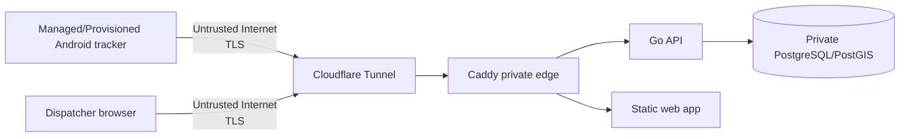

# Security Model

## 1. Scope

This document describes the security controls implemented by the application and the boundaries that remain the responsibility of deployment/operations.

It is not a compliance certification and does not replace an organizational risk assessment. For HIPAA-specific deployment considerations, see [HIPAA.md](HIPAA.md).

## 2. Security objectives

The implementation is designed around the following goals:

- only provisioned tracker devices can submit vehicle telemetry;
- only authenticated dispatch users can read fleet/history data or receive dispatcher realtime events;
- long-lived credentials are not stored in plaintext server-side;
- network exposure is minimized;
- telemetry delivery is replay-safe and auditable;
- failed authentication attempts are rate-limited;
- revocation/rotation can invalidate application sessions;
- tracker payloads exclude patient/clinical fields by design.

## 3. Trust boundaries



Trust boundaries:

1. **Device boundary** — a stolen/unmanaged phone can expose locally available operational telemetry or credentials depending on device compromise.
2. **Internet/edge boundary** — all production client traffic must use HTTPS/WSS.
3. **Application boundary** — Caddy forwards same-origin API/web traffic to the internal services.
4. **Database boundary** — PostgreSQL is reachable only on the internal Docker network in the supplied production topology.
5. **Operator boundary** — host access, `.env`, Cloudflare credentials, backup storage, signing keys, and MDM policies are outside the application process.

## 4. Identity and credentials

### Dispatcher users

- Usernames are unique.
- Passwords are hashed with bcrypt.
- Successful login creates a random opaque session token and a separate CSRF token.
- Only the hashes of session and CSRF tokens are stored in PostgreSQL.
- The browser session token is delivered in an `HttpOnly` cookie.
- Production is expected to set `Secure` cookies.
- `SameSite=Strict` is used.
- Password rotation revokes existing dispatcher sessions.

Current limitation: MFA/SSO is not implemented. Production deployments with higher assurance requirements should add an identity-provider-backed authentication path rather than relying indefinitely on password-only local accounts.

### Tracker devices

- A tracker is bound to a provisioned vehicle and long-lived device key.
- The server stores the device-key hash, not the plaintext key.
- Device authentication returns a short-lived bearer token.
- Bearer tokens are stored only as hashes server-side.
- Device-key rotation revokes active device sessions.
- Android stores its provisioned configuration using Android Keystore-backed encryption.

Device keys are credentials, not identifiers. Do not place them in screenshots, tickets, logs, source files, sample configuration, or chat transcripts.

## 5. Session lifecycle

### Dispatcher

- REST reads require a valid database-backed user session.
- Logout requires CSRF validation and revokes the current session.
- Dispatcher WebSocket sessions are revalidated periodically; revocation/expiry closes the connection.

### Tracker

- Tracker WebSocket is accepted only after validating the bearer token.
- The bearer session is revalidated periodically during the WebSocket lifetime.
- Revoked/expired sessions are closed.

## 6. Authentication rate limiting

The API applies fixed-window, source-IP rate limits to login/device-session creation.

Current limits:

- dispatcher login: 10 attempts per one-minute source-IP window;
- device authentication: 20 attempts per one-minute source-IP window.

The limiter is process-local. It is suitable for the current single-process deployment. If the API is horizontally scaled, the limit must move to shared state and/or the edge so multiple replicas cannot each maintain an independent allowance.

## 7. Network exposure

The production Compose stack intentionally does not publish:

- PostgreSQL `5432`;
- API `8080`;
- Caddy `80/443`;
- web `80`.

Cloudflare Tunnel creates the public path outbound from the host and routes to `http://caddy:80` inside the `edge` network.

The database is attached only to the isolated `internal` network. The API is the only application service connected to both database and edge networks.

This design reduces accidental host exposure, but host firewalling and administrative-service exposure (SSH, Proxmox, etc.) remain deployment responsibilities.

## 8. Transport security

The Android UI refuses to start tracking unless the configured server URL begins with `https://`.

Production should terminate client TLS at the trusted public edge and maintain the private tunnel path to the origin. The supplied Caddy origin is intentionally HTTP-only inside the Docker/tunnel boundary.

Do not weaken Android cleartext restrictions to work around deployment problems in production.

## 9. Request and message bounds

The API limits untrusted input to reduce resource-abuse risk:

- generic JSON reader is limited to 32 KiB;
- tracker WebSocket read limit is 8 KiB per message;
- replay request body is limited to 512 KiB;
- replay batch count is limited to 500 locations;
- history playback is limited to 1–24 hours;
- history output is down-sampled to at most 5,000 points.

Location validation also bounds coordinates and accepted timestamps.

## 10. Browser security controls

The Go service/Caddy path applies restrictive headers including:

- `X-Content-Type-Options: nosniff`;
- `Referrer-Policy: no-referrer`;
- restrictive `Permissions-Policy`;
- Content Security Policy restricting default, connection, image, worker, script, font, form, frame and object sources;
- HSTS at the edge/origin configuration where appropriate;
- frame-denial protections.

The current CSP allows the OpenFreeMap map origin required by the UI.

## 11. Data integrity and replay safety

Telemetry is modeled as immutable events keyed by:

```text
(device_id, tracking_session_id, sequence_number)
```

The database enforces uniqueness for this identity. Duplicate submissions do not produce duplicate rows.

This is a security/reliability property as well as an offline-delivery property: retries cannot silently multiply the same event.

The server persists a new location before broadcasting it to dispatcher clients.

## 12. Audit logging

The application records structured database audit events for security/operational actions including:

- dispatcher login/logout;
- device session creation;
- tracker connection;
- dispatcher WebSocket connection;
- fleet reads;
- route-history reads;
- tracker replay batches;
- authentication failures/rate limits where implemented.

Audit records contain source IP where available, actor/resource identifiers, outcome and metadata.

Current limitation: the repository does not ship audit records to external immutable storage. A privileged database/host operator can still alter application data. Production should export logs/audits to separately controlled retention infrastructure.

## 13. Secrets and sensitive configuration

Never commit:

- `.env`;
- Cloudflare tunnel token;
- PostgreSQL production password;
- real dispatcher passwords;
- tracker device keys;
- Android signing keystore/passwords;
- private TLS/SSH keys.

The repository ignores common signing-keystore extensions and `.env`, but `.gitignore` is only a guardrail. Operators remain responsible for secret handling.

## 14. Android signing

Production Android APKs should use one stable signing identity.

The manual `android-release` workflow expects the keystore material/passwords as GitHub Actions secrets, reconstructs the keystore only on the runner, builds the release, uploads the APK artifact and deletes the temporary keystore.

The master signing key must also be stored securely outside GitHub. Compromise requires release-key incident response; loss prevents updates to existing installations under the same application ID.

## 15. Backup security

The supplied backup helper creates PostgreSQL custom-format dumps with restrictive local file permissions and SHA-256 checksums.

Checksums provide corruption/tamper detection, not confidentiality. Production backup storage should add encryption at rest and access controls appropriate to the sensitivity of vehicle-location and audit data.

Backups should be stored off the application VM and restore-tested.

## 16. Data classification

Tracker payloads intentionally contain operational vehicle telemetry and no patient/clinical fields.

Location data should still be treated as sensitive operational data. Depending on how a deployment links vehicle locations to dispatch/patient workflows, location records may become associated with identifiable care events. The absence of patient fields in this repository does not guarantee that all deployments remain outside PHI/ePHI scope.

## 17. Known production gaps

The following are not solved by the current codebase:

- MFA/SSO;
- centralized immutable audit/log retention;
- host-level hardening and patch management;
- encrypted/off-host backup policy and key management;
- MDM enforcement for tracker phones;
- remote attestation/device-integrity checks;
- automatic server-side telemetry retention/deletion;
- high-availability database/failover;
- multi-node shared realtime pub/sub;
- formal incident-response workflow;
- formal vulnerability-management/penetration-test program;
- organizational access reviews and workforce procedures.

These are release/deployment responsibilities, not reasons to describe the code as "HIPAA certified" or automatically compliant.

## 18. Security review checklist for changes

For every security-relevant PR, review:

- Does it add a new public endpoint or port?
- Does it add a new secret or sensitive field?
- Does it change session/credential lifetime or revocation?
- Does it bypass HTTPS/secure cookie requirements?
- Does it weaken request size or input validation?
- Does it change audit coverage?
- Does it introduce patient/clinical data?
- Does it affect offline idempotency or event identity?
- Does it change backup/restore exposure?
- Does documentation and the API contract remain accurate?
