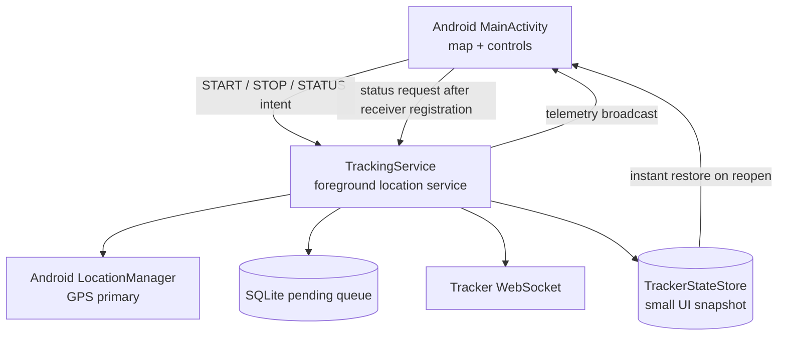
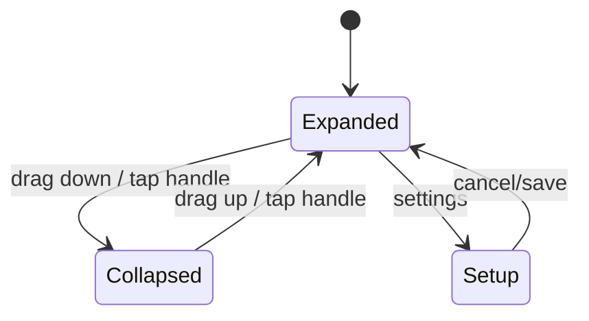
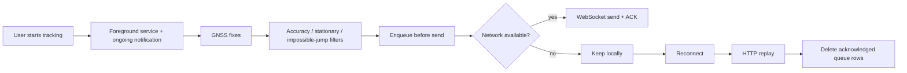
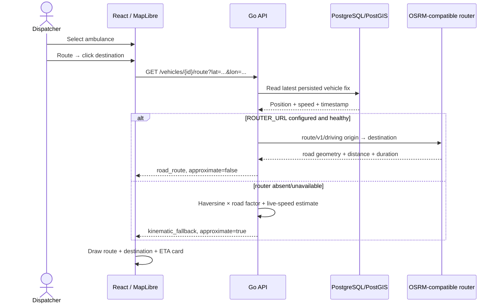

# Tracker Lifecycle and Route Planning

This document describes two user-visible behaviors added after field testing: immediate tracker-state recovery when reopening the Android activity, and dispatcher route/ETA planning from live ambulance telemetry.

## Android activity versus tracking service

The map/activity is not the tracking engine. The foreground service owns GNSS collection, buffering, authentication, and transport.



Previously, reopening the activity initialized the UI to `Stopped` and waited for the service's next telemetry broadcast. A live tracker could therefore briefly display **Start tracking** even though the foreground service was already running.

The activity now:

1. renders the last persisted service snapshot immediately;
2. keeps the Start control disabled until service state is known if no snapshot exists;
3. registers the telemetry receiver;
4. sends a status request to the service; and
5. reconciles the UI with the service's authoritative current state.

This fixes the UI race without starting a second tracking session merely because the activity was reopened.

## Operational bottom sheet

The Android operational surface is intentionally a bottom sheet over the map rather than a permanent fixed panel.



When collapsed, the sheet leaves a small status/control peek visible while exposing substantially more map area. The map remains pannable and zoomable independently.

## Background tracking reliability



The application exposes Android battery-optimization state because a foreground service is not a promise that every OEM firmware will behave identically under Battery Saver/Doze. Dedicated tracker devices should be field-tested and configured as Unrestricted/Not optimized when appropriate.

## Dispatcher route planning

The route planner starts from the latest **persisted** location for the selected vehicle. Persisted state is used so route planning still works from the last known position if the WebSocket disconnects moments before a route request.



While a route is active, the dispatcher refreshes it at a bounded 20-second cadence instead of requesting a new route for every 1 Hz telemetry fix. This keeps ETA reasonably current without turning live telemetry into a routing-provider request storm.

## Endpoint

```http
GET /api/v1/vehicles/{vehicleID}/route?lat=17.30&lon=-62.72
```

Authentication: dispatcher session.

Representative response:

```json
{
  "vehicle_id": "...",
  "origin": {
    "latitude": 17.3029,
    "longitude": -62.7178,
    "accuracy_m": 8.4
  },
  "destination": {
    "latitude": 17.329,
    "longitude": -62.779
  },
  "distance_m": 7800,
  "duration_seconds": 690,
  "eta_at": "2026-09-14T14:20:00Z",
  "method": "road_route",
  "approximate": false,
  "geometry": {
    "type": "LineString",
    "coordinates": [[-62.7178, 17.3029], [-62.72, 17.305]]
  },
  "location_recorded_at": "2026-09-14T14:08:20Z",
  "generated_at": "2026-09-14T14:08:30Z"
}
```

The API never presents the fallback as road navigation. `approximate=true` is part of the contract and the dispatcher surfaces that distinction visibly.

## What this is not yet

The route feature is dispatch-side **path planning and ETA**, not full turn-by-turn navigation on the ambulance phone. Full navigation would require additional work such as route instructions, rerouting, maneuver presentation, geocoding/place search, road closures/traffic data, and operational validation of the routing dataset.

Those features can be layered on later without changing the tracker telemetry protocol.
